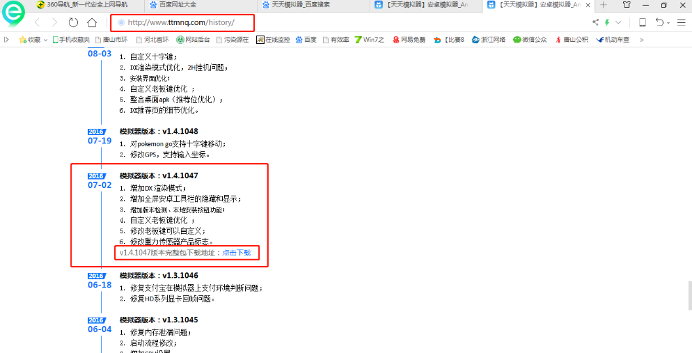
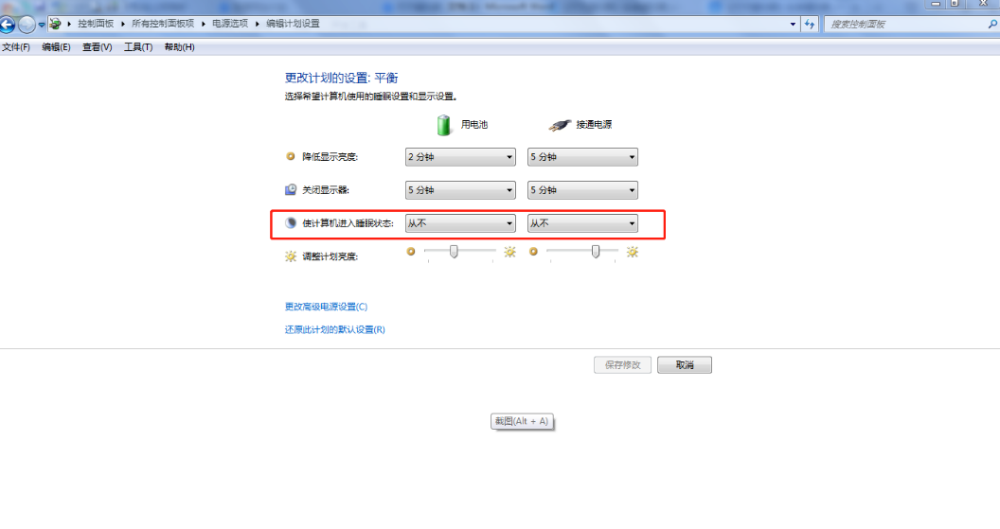
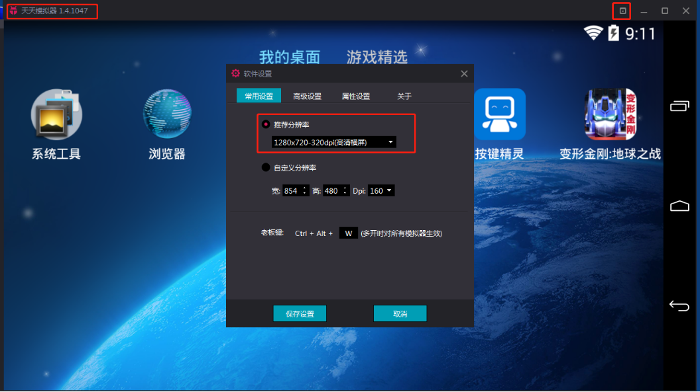
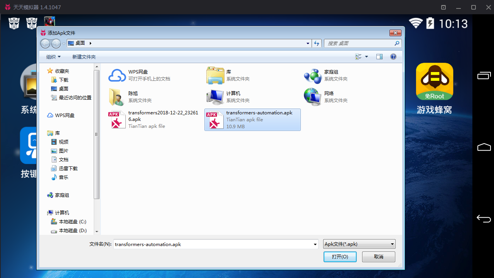
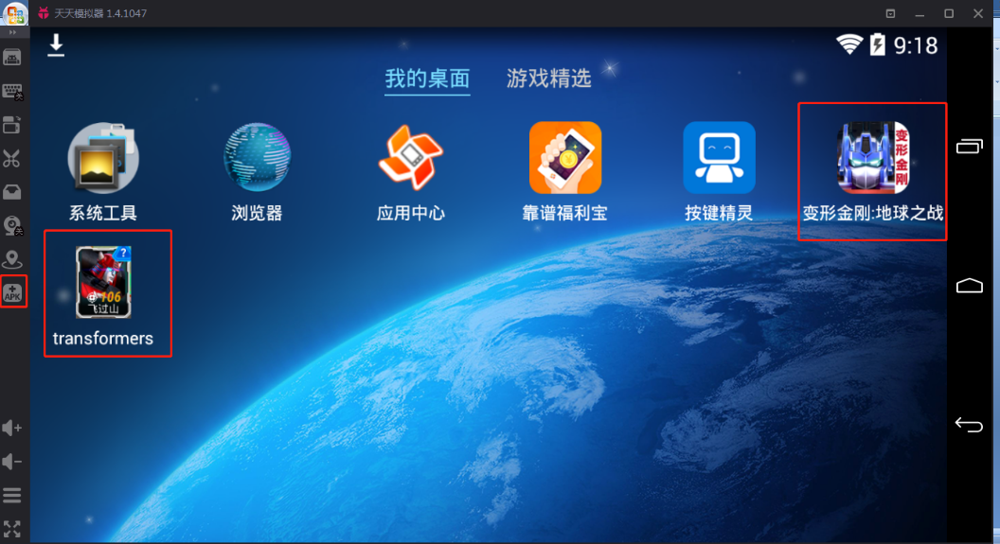
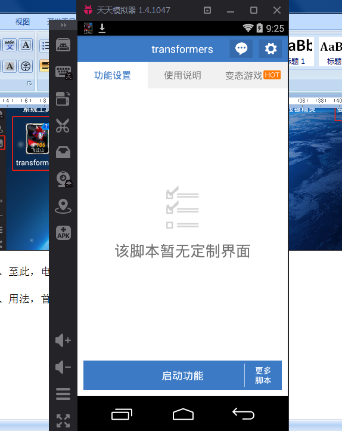
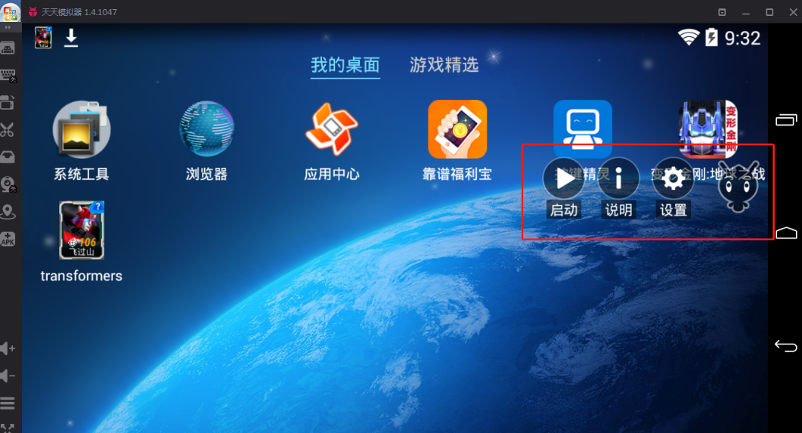

# 变形金刚-地球之战 无人值守刷分

## 挂机原则

- 只上队伍1~3，**所以请将最强的机器人都放在这3队**
- 脚本现在只能平推，无法释放技能
- 直接进入推荐战区前第二个战区进行平推，如一个队推荐战区是7500，那么进入战斗的战区是4300

## 安装说明

1. 电脑安装天天模拟器V1.4.1047	，下载地址：<http://www.ttmnq.com/history> 别的模拟器保证不了正常运行。

2. 电脑进控制面板－电源管理－更改计划设置－使计算机进入休眠状态选成`从不`。

3. 安装好天天模拟器，点模拟器右上角下箭头，更改模拟器分辨率如下图：

4. 重新启动模拟器，将游戏和挂机刷分app安装文件保存到电脑，点模拟器左边竖列apk添加本地应用，安装好游戏和挂机刷分app，如下图：

[点击这里下载脚本安装文件](https://codeload.github.com/oicqcx/transformers-automation/zip/master)

5. 至此，电脑所有需要的环境已部署完成。

## 脚本用法

1. 首先在模拟器上运行刷法脚本app，进入软件后点启动功能，启动成功后模拟器会自动回到桌面，而且桌面右边会有脚本图标，如下图：

  
2. 运行游戏，进入到游戏主界面把所有提示窗口，都关闭后，点上图的启动后，右边那小精灵变成绿色，就正常挂机自动打了。

